<div align="center">




<br/>

<a href="https://www.linkedin.com/in/denis-humen-334974260/"></a>
<a href="https://t.me/DenisHumen"></a>
<a href="https://steamcommunity.com/id/Krokosha/"></a>
<a href="https://github.com/DenisHumen?tab=repositories"></a>
<br/>


</div>

## `01` &nbsp; Know About Me

<table>
<tr>
<td width="70%" valign="top">

### Hey there, I'm Denis 👋

I'm a **network & security engineer** who kept sliding down the stack until he was writing the tools himself. I spend my time somewhere between `nftables`, packet dumps and a terminal that has been open for three days.

Most of what I build exists because I refused to do something manually twice. Firewalls that block things while I sleep 🛡️, balancers that route around dead providers 🔀, and node infrastructure that installs itself with one command ⚡.

Currently in the wired with **The Blackwall** (real-time network defense), **vlb** (multi-provider traffic balancer in Rust) and **OpenCRM**.

🐍 Python for logic · 🦀 Rust when it has to survive · 🔷 TypeScript when a human has to look at it · 🐚 Bash when nobody is watching.

</td>
<td width="30%" align="center" valign="middle">



</td>
</tr>
</table>

<div align="center"></div>

## `02` &nbsp; Protocol Stack

<div align="center">

**Languages**


**Networks & Security**


**Infra & Tooling**


</div>

<div align="center"></div>

## `03` &nbsp; Signal / Projects

> Everything here started as *"I'll just automate this real quick."*

<table>
<tr>
<td width="50%" valign="top">

### 🧱 [The Blackwall](https://github.com/DenisHumen/The-Blackwall)

Network security management. Real-time traffic monitoring, automatic threat blocking and attack visualization on `Python + React + nftables`. Your digital fortress between the corporate network and the chaos of the Net. **Stay protected, netrunner.** 🌆⚡

</td>
<td width="50%" valign="top">

### 🔀 [vlb — Virtual Load Balancer](https://github.com/DenisHumen/vlb-Virtual-Load-Balancer)

Lightweight `Rust` balancer that spreads traffic across multiple providers. Small binary, no daemons with opinions, no config file that needs its own documentation.

</td>
</tr>
<tr>
<td width="50%" valign="top">

### ⛓️ [ETHmachine](https://github.com/DenisHumen/ETHmachine)

Toolkit for working with Ethereum networks — and more. Written so I never again have to click the same button on 40 wallets. ⭐ My most-starred act of laziness.

</td>
<td width="50%" valign="top">

### 💾 [DiskWipe.IO](https://github.com/DenisHumen/DiskWipe.IO)

A stylish `TypeScript` tool for checking drive health with exportable reports. Tells you your disk is dying — politely, and in a nice UI.

</td>
</tr>
<tr>
<td width="50%" valign="top">

### 🧊 [MineAdmin](https://github.com/DenisHumen/MineAdmin)

Modern web dashboard for Minecraft server automation: one-click install, web terminal, live resource monitoring. Running a Minecraft server like a Fortune 500 datacenter. 🧱

</td>
<td width="50%" valign="top">

### 📇 [OpenCRM](https://github.com/DenisHumen/OpenCRM)

Open-source CRM for small businesses. Because every "simple client spreadsheet" eventually becomes a database, whether you planned for it or not.

</td>
</tr>
</table>

<div align="center">
<sub>Also in the archive:
<a href="https://github.com/DenisHumen/Universal-Video-Downloader-">Universal Video Downloader</a> ·
<a href="https://github.com/DenisHumen/Anisync">Anisync</a> ·
<a href="https://github.com/DenisHumen/proxy_checker">proxy_checker</a> ·
<a href="https://github.com/DenisHumen/CryptoProjectChecker">CryptoProjectChecker</a> ·
<a href="https://github.com/DenisHumen/toolkit">toolkit</a> ·
<a href="https://github.com/DenisHumen/Scripts">Scripts</a></sub>
</div>

<div align="center"></div>

## `04` &nbsp; Traffic / Stats

<div align="center">


</div>

<div align="center"></div>

## `05` &nbsp; Contribution Snake

<div align="center">

<picture>
  <source media="(prefers-color-scheme: dark)" srcset="https://raw.githubusercontent.com/DenisHumen/DenisHumen/output/snake-dark.svg" />
  <source media="(prefers-color-scheme: light)" srcset="https://raw.githubusercontent.com/DenisHumen/DenisHumen/output/snake.svg" />
  
</picture>

<sub>🐍 eats commits · leaves nothing behind · unlike my browser tabs</sub>

</div>

<div align="center"></div>

## `06` &nbsp; Layer 08 — Misc

```console
$ whoami
denis // fan of network technologies

$ uptime
too long, mostly focusing

$ cat ~/.philosophy
> "No matter where you go, everyone's connected."
  ...which is also my excuse for every load balancer I have ever written.

$ git blame
> traceroute, but for bad decisions

$ ls ~/projects | grep checker | wc -l
more than I have reasons for

$ ping me
telegram: @DenisHumen
```

<div align="center">

<br/>

> *"Present day. Present time."* 🌐
>
> If you're not remembered, you never existed — luckily `git log` remembers everything. Even the commits called `fix`.

<br/>


<sub>⚡ Built in the wired · Ukraine 🇺🇦 · <code>protocol 7 // always on</code></sub>

</div>
