<div align="center">


<br/>

<a href="https://www.linkedin.com/in/denis-humen-334974260/"></a>
<a href="https://t.me/DenisHumen"></a>
<a href="https://steamcommunity.com/id/Krokosha/"></a>
<a href="https://github.com/DenisHumen?tab=repositories"></a>
<br/>


</div>

##  &nbsp;`01` &nbsp; Know About Me

<table>
<tr>
<td width="64%" valign="top">

### Hey there, I'm Denis 

I'm a **network & security engineer** who kept sliding down the stack until he was writing the tools himself. I spend my time somewhere between `nftables`, packet dumps and a terminal that has been open for three days.

Most of what I build exists because I refused to do something manually twice:

&nbsp; **Firewalls** that block things while I sleep<br/>
&nbsp; **Balancers** that route around dead providers<br/>
&nbsp; **Node infrastructure** that installs itself with one command

**Currently in the wired with** — [AceDeck](https://github.com/DenisHumen/ace-step-deck) (local AI music studio for ACE-Step 1.5) · [The Blackwall](https://github.com/DenisHumen/The-Blackwall) (Linux gateway control panel) · [vlb](https://github.com/DenisHumen/vlb-Virtual-Load-Balancer) (multi-uplink failover gateway in Rust) · [OpenCRM](https://github.com/DenisHumen/OpenCRM).

&nbsp; `Python` for logic &nbsp;&nbsp;
&nbsp; `Rust` when it has to survive<br/>
&nbsp; `TypeScript` when a human has to look at it &nbsp;&nbsp;
&nbsp; `Bash` when nobody is watching

</td>
<td width="36%" align="center" valign="middle">



<sub><code>layer 07 // she is watching</code></sub>

</td>
</tr>
</table>

<div align="center"></div>

##  &nbsp;`02` &nbsp; Protocol Stack

<div align="center">

**Languages**


**Networks & Security**


**Infra & Tooling**


</div>

<div align="center"></div>

##  &nbsp;`03` &nbsp; Signal / Projects

> Everything here started as *"I'll just automate this real quick."*

<table>
<tr>
<td width="50%" valign="top">

<a href="https://github.com/DenisHumen/ace-step-deck"></a>

###  [AceDeck](https://github.com/DenisHumen/ace-step-deck)

Desktop studio for <b>ACE-Step 1.5</b> — local AI music generation on your own GPU. One-click install, a queue that renders songs while you sleep, cover &amp; repaint, a stability stress test and an MCP server so Claude can drive it. `Electron + React`. <b>Newest signal in the wired.</b>

</td>
<td width="50%" valign="top">

<a href="https://github.com/DenisHumen/The-Blackwall"></a>

###  [The Blackwall](https://github.com/DenisHumen/The-Blackwall)

Self-hosted control panel for a Linux gateway: live system &amp; traffic dashboard, multi-WAN load balancing with health checks and automatic failover, one-click updates. `FastAPI + React`. <b>Stay protected, netrunner.</b>

</td>
</tr>
<tr>
<td width="50%" valign="top">

<a href="https://github.com/DenisHumen/vlb-Virtual-Load-Balancer"></a>

###  [vlb — Virtual Load Balancer](https://github.com/DenisHumen/vlb-Virtual-Load-Balancer)

Multi-uplink failover gateway in `Rust`: probes every ISP (ICMP, DNS, content canary, throughput) and moves the default route the moment one dies. btop-style TUI, per-client stats. No config file that needs its own documentation.

</td>
<td width="50%" valign="top">

<a href="https://github.com/DenisHumen/ETHmachine"></a>

###  [ETHmachine](https://github.com/DenisHumen/ETHmachine)

Terminal toolkit for multi-wallet crypto routine: balances across 29 EVM networks, DeBank, transfers, Relay bridge, CEX withdrawals (OKX, Binance, Bitget, MEXC). Written so I never again click the same button on 40 wallets.  My most-starred act of laziness.

</td>
</tr>
<tr>
<td width="50%" valign="top">

<a href="https://github.com/DenisHumen/OpenCRM"></a>

###  [OpenCRM](https://github.com/DenisHumen/OpenCRM)

Self-hosted CRM for small businesses: job boards, clients, stock with barcodes, orders, printed forms and finance — one command installs it, and it updates and backs itself up. Because every "simple client spreadsheet" eventually becomes a database.

</td>
<td width="50%" valign="top">

<a href="https://github.com/DenisHumen/MineAdmin"></a>

###  [MineAdmin](https://github.com/DenisHumen/MineAdmin)

Web panel for Minecraft servers: one-click Vanilla / Paper / Purpur / Fabric / Forge, web console, file manager, backups with SFTP upload and live monitoring. Running a Minecraft server like a Fortune 500 datacenter.

</td>
</tr>
<tr>
<td width="50%" valign="top">

<a href="https://github.com/DenisHumen/DiskWipe.IO"></a>

###  [DiskWipe.IO](https://github.com/DenisHumen/DiskWipe.IO)

S.M.A.R.T. health monitor and secure formatter for Windows &amp; Linux — CrystalDiskInfo-style readouts, USB bridges, full sector erase and PDF reports. `Tauri 2 + Rust`. Tells you your disk is dying — politely.

</td>
<td width="50%" valign="top">

<a href="https://github.com/DenisHumen/Universal-Video-Downloader-"></a>

###  [Universal Video Downloader](https://github.com/DenisHumen/Universal-Video-Downloader-)

Desktop downloader on `yt-dlp + ffmpeg` with automatic stream detection for almost any site, trimming, conversion, title search and series auto-download. `Electron + React`.

</td>
</tr>
</table>

<div align="center">
<sub>More in the wired:
<a href="https://github.com/DenisHumen/telegram_export">TgVault</a> ·
<a href="https://github.com/DenisHumen/iphone-webcam">ClearCam (iphone-webcam)</a> ·
<a href="https://github.com/DenisHumen/Anisync">Anisync</a> ·
<a href="https://github.com/DenisHumen/toolkit">toolkit</a> ·
<a href="https://github.com/DenisHumen/krokosha-site">krokosha-site</a> ·
<a href="https://github.com/DenisHumen/opinionwinners">opinionwinners</a> ·
<a href="https://github.com/DenisHumen/abstract_withdraw">abstract_withdraw</a> ·
<a href="https://github.com/DenisHumen/Scripts">Scripts</a> ·
<a href="https://github.com/DenisHumen/proxy_checker">proxy_checker</a> ·
<a href="https://github.com/DenisHumen/CryptoProjectChecker">CryptoProjectChecker</a></sub>
</div>

<div align="center"></div>

##  &nbsp;`04` &nbsp; Traffic / Stats

<div align="center">


</div>

<div align="center"></div>

##  &nbsp;`05` &nbsp; Contribution Snake

<div align="center">

<picture>
  <source media="(prefers-color-scheme: dark)" srcset="https://raw.githubusercontent.com/DenisHumen/DenisHumen/output/snake-dark.svg" />
  <source media="(prefers-color-scheme: light)" srcset="https://raw.githubusercontent.com/DenisHumen/DenisHumen/output/snake.svg" />
  
</picture>

<sub>eats commits · leaves nothing behind · unlike my browser tabs</sub>

</div>

<div align="center"></div>

##  &nbsp;`06` &nbsp; Layer 08 — Misc

<table>
<tr>
<td width="62%" valign="middle">

```console
$ whoami
denis // fan of network technologies

$ uptime
too long, mostly focusing

$ cat ~/.philosophy
> "No matter where you go, everyone's connected."
  ...which is also my excuse for every load balancer I have ever written.

$ git blame
> traceroute, but for bad decisions

$ ls ~/projects | grep checker | wc -l
more than I have reasons for

$ ping me
telegram: @DenisHumen
```

</td>
<td width="38%" align="center" valign="middle">


<sub><code>navi // online</code></sub>

</td>
</tr>
</table>

<div align="center">

<br/>

> &nbsp; *"Present day. Present time."*
>
> If you're not remembered, you never existed — luckily `git log` remembers everything. Even the commits called `fix`.

<br/>



<sub> Built in the wired ·  Ukraine · <code>protocol 7 // always on</code></sub>

</div>
